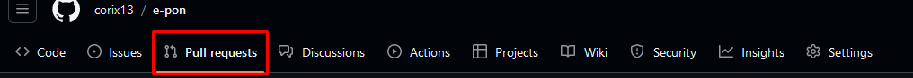
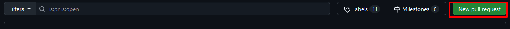
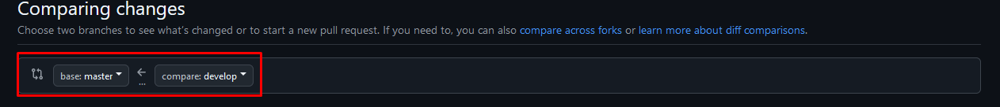
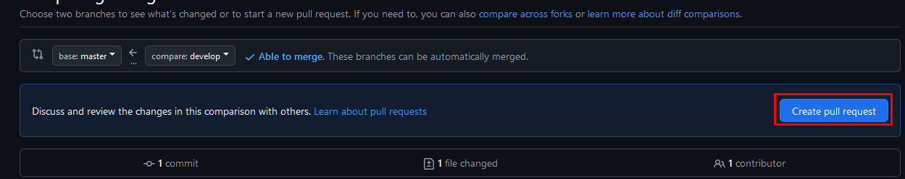
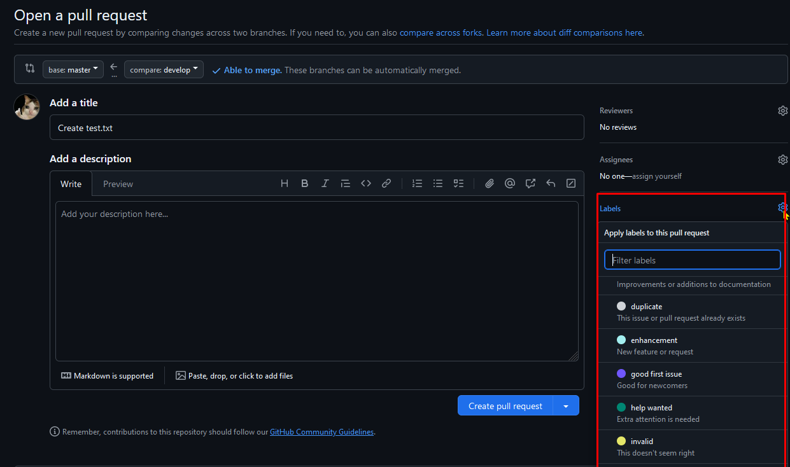

# E-PON - An app where you can save and track your money.

## For Hacktoberfest 2024 participation. 


This is a [Next.js](https://nextjs.org) project bootstrapped with [`create-next-app`](https://nextjs.org/docs/app/api-reference/cli/create-next-app).

## Table of Contents
- [About](#about)
- [Getting Started](#getting-started)
- [Contributing](#contributing)
- [Learn More](#learn-more)
- [Deploy on Vercel](#deploy-on-vercel)
- [Contributors](#contributors)
---

## About
E-PON is a web application designed to help users save and track their money efficiently. The app provides tools for financial management, allowing users to monitor their savings goals, daily expenditures, and overall financial health.

E-PON aims to make money management simpler, helping users take control of their finances and make informed decisions about saving and spending.

## Getting Started

### Prerequisites

What things you need to install the software and how to install them:
- [Visual Studio Code](https://code.visualstudio.com/download)
- [Node.js](https://nodejs.org/en/download/)
- [npm](https://www.npmjs.com/get-npm)
- [Git](https://git-scm.com/downloads)

### Installation

A step by step series of examples that tell you how to get a development env running:
1. Clone the repository
```bash
git clone https://github.com/corix13/e-pon
```

2. Install the dependencies
```bash
npm install
```

3. Start the application
```bash
npm run dev
```

## Contributing
To contribute to this project, you need to follow the steps below:
1. Clone this repository.
2. Create your local branch.
3. Make your changes and commit.
4. Merge your change to develop branch.
5. Push it to develop origin branch.
6. Create pull request on master branch in Github.

### Creating Pull Request in Github
1. Go to Pull Request tab in Github Repository.

2. Click New Pull Request button.

3. Make sure to compare develop branch to master branch.

4. Then click Create Pull Request button.

5. Add details title and description. Select label `hacktoberfest` on right panel. Also assign reviewers to review your code.


## Learn More

To learn more about Next.js, take a look at the following resources:

- [Next.js Documentation](https://nextjs.org/docs) - learn about Next.js features and API.
- [Learn Next.js](https://nextjs.org/learn) - an interactive Next.js tutorial.

You can check out [the Next.js GitHub repository](https://github.com/vercel/next.js) - your feedback and contributions are welcome!

## Deploy on Vercel

The easiest way to deploy your Next.js app is to use the [Vercel Platform](https://vercel.com/new?utm_medium=default-template&filter=next.js&utm_source=create-next-app&utm_campaign=create-next-app-readme) from the creators of Next.js.

Check out our [Next.js deployment documentation](https://nextjs.org/docs/app/building-your-application/deploying) for more details.

---

## Contributors:
<a href="https://github.com/corix13/e-pon/graphs/contributors">
  
</a>

Made with [contrib.rocks](https://contrib.rocks).